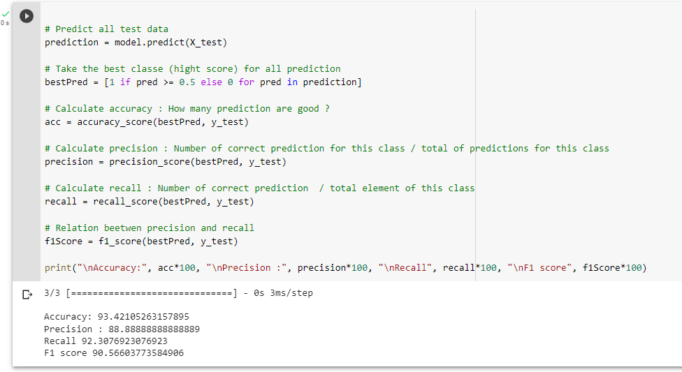

# Pima_Indians_Diabetes.csv

### Énoncé :
À partir du jeu de données « Prima Indians Diabète » provenant de Kaggle
et disponible sur Moodle, l'objectif est de réaliser un réseau de neurones
capable de classer les patients atteints ou non de diabète.

Le jeu de données fourni contient 769 cas représentant tous des femmes,
chacun avec 8 caractéristiques ainsi qu'une étiquette indiquant si la
personne est atteinte (1) ou non (0) de diabète.

Descriptions des variables
1. Pregnancies (grossesses) : Le nombre de grossesses que la patiente a
eues.
2. Glucose : La concentration de glucose dans le sang de la patiente.
3. BloodPressure (pression artérielle) : La pression artérielle de la
patiente (en mmHg).
4. SkinThickness (épaisseur de la peau) : L'épaisseur du pli cutané du
triceps de la patiente (en mm).
5. Insulin : La concentration d'insuline dans le sang de la patiente (en
mU/L).
6. BMI (indice de masse corporelle) : L'indice de masse corporelle de la
patiente, qui est calculé en divisant le poids de la patiente (en kg) par
2/3Poirier Fabien
2022-2023
le carré de sa taille (en mètres).
7. DiabetesPedigreeFunction : Une mesure de la probabilité de diabète
chez les parents et les ancêtres de la patiente, qui est basée sur les
antécédents familiaux.
8. Age : L'âge de la patiente (en années).
9. Outcome (résultat) : Une variable binaire qui indique si la patiente a
développé un diabète de type 2 (1) ou non (0) dans les 5 ans suivant
les observations.

### Requirements
```bash
pip install numpy pandas seaborn matplotlib scikit-learn keras tensorflow
or from notebook
!pip install numpy pandas seaborn matplotlib scikit-learn keras tensorflow
```

### Code :

<a target="_blank" href="https://colab.research.google.com/github/https://colab.research.google.com/github/pthavarasa/Pima_Indians_Diabetes.csv/blob/main/Diabetes_detection.ipynb">
  
</a>

### Les techniques
- Imputation
  - median
  - median + indicator (meilleur résultat)
  - KNNImputer
  - KNNImputer + indicator
- Mise à l'échelle
  - MinMaxScaler
- Train-Test Split
  - train_test_split (meilleur résultat)
  - KFold
- Model
  - Sequential(1 hidden layer 19 neurons) (meilleur résultat)
- Métrique
  - Accuracy
  - Precision
  - Recall
  - F1 score
  - confusion matrix
  
### résultats (peuvent varier À chaque itération)


